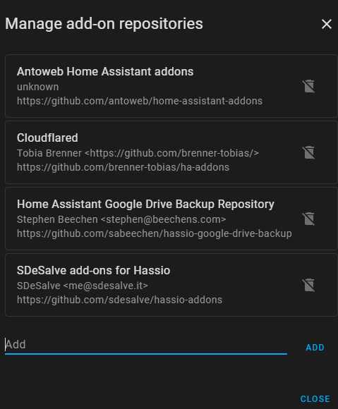
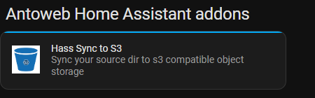
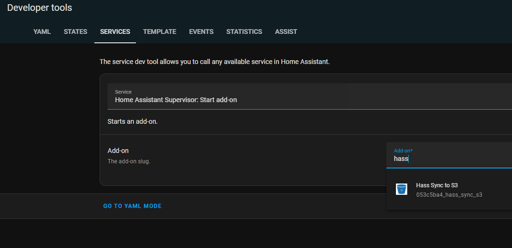

![Supports aarch64 Architecture][aarch64-shield] ![Supports amd64 Architecture][amd64-shield] ![Supports armhf Architecture][armhf-shield] ![Supports armv7 Architecture][armv7-shield] ![Supports i386 Architecture][i386-shield]

[aarch64-shield]: https://img.shields.io/badge/aarch64-yes-green.svg
[amd64-shield]: https://img.shields.io/badge/amd64-yes-green.svg
[armhf-shield]: https://img.shields.io/badge/armhf-yes-green.svg
[armv7-shield]: https://img.shields.io/badge/armv7-yes-green.svg
[i386-shield]: https://img.shields.io/badge/i386-yes-green.svg

# Home Assistant Add-on: Hass-backup-s3

## What is it for ?

The goal of this addon is to sync a Home Assistant source folder such as /config /ssl /backup /media with compatible s3 storage.

It use the aws cli for achieve that

This addon make a tar.gz of the source folder and upload it on your s3 bucket. After the tar.gz created locally will be deleted (attention for the docker architecture the tar.gz is deleted after some minutes, for this reason please wait almost 5 minutes before relaunch the addon otherwise you will have more than one file uploaded on the s4)

This addon is a run-once application, means that the addon will be stopped after his work (tar gz and upload)


## Installation

Follow these steps to get the add-on installed on your system:

:warning: Important : Make sure you've added my addon repository to your home-assistant addon library : https://github.com/antoweb/home-assistant-addons

1. Navigate in your Home Assistant go to Settings/Addons and than click to ADDON-STORE low right corner, click on three dots upper right corner and click on Repositories




2. Paste the following url on the text box Add: https://github.com/antoweb/home-assistant-addons and clos
3. Update Your Browser page and than you have a new repository




4. Click on "Hass Sync to S3" and install it


## How configure it

In the configuration section, set the repository field to your s3 provider access key and secret key, endpoint url and region (ex: eu-west-1 for aws ireland). Please note all fields are required exceppt endpointUrl, but in case of endpointUrl is empty the addon default upload to aws s3! 

### Addon Configuration

Add-on configuration:

```yaml
bucketName: myBucketName
endpointUrl: <YOUR-ENDPOINT>>
region: <BUCKET REGION>
accessKey: null
secretKey: null
#restore: false
```

### OpTion: `sourceDir` (required)

Default to /backup. The directory you want to backup

/media, /ssl  are mounted as rw as well, so you can backup them too, /config is mounted as read-only for security reason.

Only one argument is allowed at a time

### Option: `bucketName` (required)

Name of the bucket

### Option: `endpointUrl` (required)

endpoint URL of the s3 provider

### Option: `region` (required)

region of the s3 provider

### Option: `accessKey` (required if not using Backblaze b2)

Access key, you have to retrieve an access key from your s3 provider

### Option: `secretKey` (required if not using Backblaze b2)

Secret key, you have to retrieve a secret access key from your s3 provider


[comment]: <> ### Option: `restore` (required) --> Not Yet implemented

[comment]: <> Default to false. Is set to true, will download the s3 content inside the backup folder to restore the snapshot.

## How to use it ?

Call this addon from your backup automations to trigger it :

```yaml
- alias: Snapshot Once A Week
  trigger:
    - platform: time
      at: '10:00:00'
  condition:
    - condition: time
      weekday:
        - wed
  action:
    - service: hassio.addon_start
      data:
        addon: "053c5ba4_hass_sync_s3" -> Note this name can be chage so check on the Developers Tools/Service for the right name see below
```


The service *hassio.addon_start* needs the addon slug to work. This is a concatenation of the first 8 char SHA1 hash of the repo url (lowercased) and the addon slug. If I ommit to update this part, you can check by yourself the hash part by taking the first 8 char of the hash here http://www.sha1-online.com/ filling "https://github.com/rbillon59/home-assistant-addons" in the form. It should not happen as the addons repository URL should not change. But in case of ..

You can also launch it manually with the start button in the addon page !


[comment]: <> ## If you need to restore the backup

[comment]: <> Just change the Option: `restore` and set it to true and launch the addon manually. It will download the last available backup of your snapshots.

[comment]: <> :warning: Please, think about setting the restore option to false after restoring your backups, or every time you will call it from [comment]: <> your automation it will restore the backups in your buckets and not upload it. 

## Support

Got questions?

You can open an issue on Github and i'll try to answer it

[repository]: https://github.com/antoweb/home-assistant-addons/issues

## License

As duplicity is distributed under the GPL license, this addon is as well under the same license
